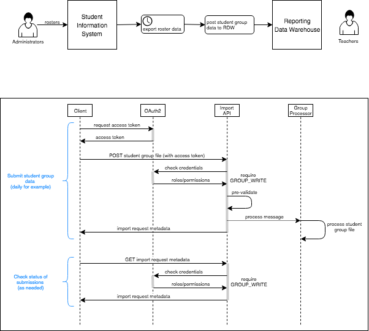

## Student Groups

**Intended Audience**: This document provides file format information for *anyone* creating student group files to be
loaded into the [Reporting Data Warehouse](../README.md) (RDW). It also provides *vendors* and *system integrators*
details of how student groups may be batch loaded into the data warehouse.

Quick Links:
* [Overview](#overview)
* [SIS Integration](#sis-integration)
    * [Sample Bash Script](#sample-bash-script)
* [CSV File Format](#csv-file-format)
    * [Sample File](#sample-file)
* [SQL Groups](#sql-groups)

### Overview

In the RDW, student groups provide a restricted view of student results for teachers and other users. A student group
may represent a classroom, a counseling group, special seminar students or any other roster of students. Although the
RDW allows for manual upload and management of groups, integrating with a Student Information System (SIS) will provide
the most timely data with a minimum of manual effort.

In the following diagram, there is a process that periodically extracts roster data from the SIS and sends it to the
RDW Import API.



The sequence diagram shows the happy path for posting the data to RDW. Documentation details the calls involved,
particularly [getting the access token](API.md#authentication-and-authorization) and [posting a groups file](API.md#groups-endpoints).
Please refer to the next section for additional details and clarification.

### SIS Integration

1. Create the student group file. This will involve transforming the source data into the required [CSV file format](#csv-file-format).
2. Acquire a password grant access token. See [Auth API](API.md#authentication-and-authorization) for details.
    * You will need the URL of the OAuth2 end-point for the SmarterBalanced SSO system.
    * You will need your client credentials. These are issued by SmarterBalanced for trusted vendors.
    * You will need credentials for a system user with permissions to create groups for all the schools involved. Users
    are created and managed in ART. The required permission is `GROUP_WRITE` and is typically granted with the `GROUP_ADMIN` role.
    * The access token should be stored so it can be used in the next step. How this is done depends on the client
    technology being used. A valid access token looks like a UUID.

A curl request for the OpenAM server will look something like:

`curl -s -X POST --data "grant_type=password&username=user@example.com&password=password&client_id=client_id&client_secret=secret" 
https://sso.smarterbalanced.org/auth/oauth2/access_token?realm=/sbac`

This is a sample response for an access token:
```json
{
    "scope": "cn givenName mail sbacTenancyChain sbacUUID sn",
    "expires_in": 35999,
    "token_type": "Bearer",
    "refresh_token": "9eb44211-0f9a-4709-acf8-3ab25b4367d4",
    "access_token": "8c29ead1-4b46-4411-8102-870590f84451"
}
```

A curl request for the Okta server is very similar:

`curl -s -X POST --data 'grant_type=password&username=user%40example.com&password=passowrd&client_id=client_id&client_secret=client_secret&scope=openid%20profile' 
https://smarterbalanced.oktapreview.com/oauth2/auslw2qcsmsUgzsqr0h7/v1/token`

Note the addition of "scope" to the data string. In addition, the client ID and secret will be
different depending on how the Okta password grant application is configured. An Okta response will
look like:

```json
{
    "token_type": "Bearer",
    "expires_in": 3600,
    "access_token": "eyjRA ...",
    "scope": "openid profile",
    "id_token": "eyJraWQiO ..."eja8FA ..."
}
```
The tokens will be very long strings, much longer than the OpenAM tokens. This is expected.

```
In either case, if the client credentials are wrong:
```json
{
    "error": "invalid_client",
    "error_description": "Client authentication failed"
}
```
If the user credentials are wrong:
```json
{
    "error": "invalid_grant",
    "error_description": "The provided access grant is invalid, expired, or revoked."
}
```
3. Post the student group file. See [Groups API](API.md#groups-endpoints) for details.
    * You will need the URL of the RDW import service.
    * You will need the access token from the previous step.
    * The response will either be an error with a message explaining the problem or metadata with status ACCEPTED
    indicating that the file was accepted and will be processed.

A curl post will look something like:

`curl -X POST --header "Authorization: Bearer ${ACCESS_TOKEN}" -F file=@group.csv https://import.rdw.smarterbalanced.org/groups/imports`

This is a sample response from posting a group file:
```json
{
  "id": 34006,
  "content": "GROUPS",
  "contentType": "text/csv",
  "digest": "8FB10902AA20C6E14EDD059B9C48B710",
  "status": "ACCEPTED",
  "batch": "demo.csv",
  "creator": "user@example.com",
  "created": "2018-05-18T19:12:43.749666Z",
  "updated": "2018-05-24T22:55:01.322245Z",
  "message": "1 group accepted for 88800120012003.\n1 group accepted for 88800120012001.",
  "_links": {
    "self": {
      "href": "https://import.rdw.smarterbalanced.org/imports/34006"
    },
    "payload": {
      "href": "https://import.rdw.smarterbalanced.org/imports/34006/payload"
    },
    "payload-properties": {
      "href": "https://import.rdw.smarterbalanced.org/imports/34006/payload/properties"
    }
  }
}
```
And an error example (the header line of the CSV file was corrupted):
```json
{
  "id": 34088,
  "content": "GROUPS",
  "contentType": "application/octet-stream",
  "digest": "5351B8D96241ADAFC2E8CF0D407F5E6E",
  "status": "BAD_DATA",
  "batch": "demo.csv",
  "creator": "user@example.com",
  "created": "2018-05-24T23:00:13.685351Z",
  "updated": "2018-05-24T23:00:13.693388Z",
  "message": "Row: 0 Failure: Invalid headers. Headers must be in order: 
  [group_name,school_natural_id,school_year,subject_code,student_ssid,group_user_login]
  Row: 0 Failure: File does not appear to be a valid CSV with a header row",
  "_links": {
    "self": {
      "href": "https://import.rdw.smarterbalanced.org/imports/34088"
    },
    "payload": {
      "href": "https://import.rdw.smarterbalanced.org/imports/34088/payload"
    },
    "payload-properties": {
      "href": "https://import.rdw.smarterbalanced.org/imports/34088/payload/properties"
    }
  }
}
```
4. (Optional) Check import status. As often as desired you may query the system for the status of the import. The
response will either be an error with a message explaining the problem or success with status PROCESSED.

This is a sample response:
```json
{
    "id": 34006,
    "content": "GROUPS",
    "contentType": "text/csv",
    "digest": "8FB10902AA20C6E14EDD059B9C48B710",
    "status": "PROCESSED",
    "batch": "demo.csv",
    "creator": "user@example.com",
    "created": "2018-05-18T19:12:43.749666Z",
    "updated": "2018-05-24T22:55:01.944377Z",
    "message": "1 group accepted for 88800120012003.\n1 group accepted for 88800120012001.",
    "_links": {
        "self": {
            "href": "https://import.rdw.smarterbalanced.org/imports/34006"
        },
        "payload": {
            "href": "https://import.rdw.smarterbalanced.org/imports/34006/payload"
        },
        "payload-properties": {
            "href": "https://import.rdw.smarterbalanced.org/imports/34006/payload/properties"
        }
    }
}
```

Once ACCEPTED it may take a while for the file to be PROCESSED. Once PROCESSED the student group changes will be visible
in the administration area of the reporting system. It will take an additional few minutes for the changes to become
visible to the end users.

#### Sample Bash Script

The following script uses bash to post a file. It uses `curl` and `jq`.

```bash
OAUTH="https://sso.smarterbalanced.org/auth/oauth2/access_token?realm=/sbac"
RDW_HOST="https://import.rdw.smarterbalanced.org"
CID=client_id
CS=client_secret
USERNAME=user@example.com
PASSWORD=password

response=`curl -s -X POST --data "grant_type=password&username=$USERNAME&password=$PASSWORD&client_id=$CID&client_secret=$CS" $OAUTH`
ACCESS_TOKEN=`echo $response | jq -r '.access_token'`
if [ "$ACCESS_TOKEN" == "null" ]; then
    echo "Failed to get access token, response received:"
    echo "$response"
    exit 1
fi

response=`curl -X POST --header "Authorization: Bearer ${ACCESS_TOKEN}" -F file=@group.csv $RDW_HOST/groups/imports`
status=`echo $response | jq -r '.status'`
if [ "$status" == "ACCEPTED" ]; then
    echo "File ACCEPTED"
    exit 0
else
    echo "File wasn't accepted, status=$status"
    exit 1
fi
```

### CSV File Format

This defines the SmarterBalanced Student Group CSV format. A template for the file may be downloaded in the
administration area of the reporting system.

The following fields are supported in the CSV file. The first three fields, `group_name`, `school_natural_id` and
`school_year` uniquely identify a group and are required in every row. If an existing group matches those fields, it
will be updated with the new data. Otherwise a new group is created. The other fields can be optionally specified to
add a student and/or user to a group. In other words, a row may contain either a `student_ssid`, a `group_user_login`
or both.

| Field             | Data Type | Description                          |
|-------------------|-----------|--------------------------------------|
| group_name        | text      | group name                           |
| school_natural_id | text      | school id                            |
| school_year       | integer   | school year, e.g. 2018 for 2017-18   |
| subject_code      | text      | All, Math, ELA                       |
| student_ssid      | text      | student ssid                         |
| group_user_login  | text      | user login                           |

#### Sample File

This sample defines two groups for 2017-18 for the school with id 88800120012001. Each group has three students and
two teachers associated with them.
```csv
group_name,school_natural_id,school_year,subject_code,student_ssid,group_user_login
JT4thGrade,88800120012001,2018,All,,
JT4thGrade,88800120012001,2018,,,jteacher@example.com
JT4thGrade,88800120012001,2018,,,btutor@example.com
JT4thGrade,88800120012001,2018,,SSID001,
JT4thGrade,88800120012001,2018,,SSID002,
JT4thGrade,88800120012001,2018,,SSID003,
ME6thGradeMath,88800120012001,2018,Math,,
ME6thGradeMath,88800120012001,2018,,,meducator@example.com
ME6thGradeMath,88800120012001,2018,,,sinstructor@example.com
ME6thGradeMath,88800120012001,2018,,SSID010,
ME6thGradeMath,88800120012001,2018,,SSID011,
ME6thGradeMath,88800120012001,2018,,SSID012,
```

### SQL Groups

It may be useful to generate a groups file from existing data. This query pulls in all the students and all the users
logins:
```sql
SELECT * FROM (
  SELECT
    sg.name        AS group_name,
    sch.natural_id AS school_natural_id,
    sg.school_year,
    sub.code       AS subject_code,
    stu.ssid       AS student_ssid,
    NULL           AS group_user_login
  FROM student_group sg
    JOIN school sch ON sg.school_id = sch.id
    JOIN student_group_membership sgm ON sg.id = sgm.student_group_id
    JOIN student stu ON sgm.student_id = stu.id
    LEFT JOIN subject sub ON sg.subject_id = sub.id
  union
  select
    sg.name        AS group_name,
    sch.natural_id AS school_natural_id,
    sg.school_year,
    sub.code       AS subject_code,
    NULL           AS student_ssid,
    usg.user_login AS group_user_login
  from student_group sg
    JOIN school sch ON sg.school_id = sch.id
    JOIN user_student_group usg ON sg.id = usg.student_group_id
    LEFT JOIN subject sub ON sg.subject_id = sub.id
) data
ORDER BY group_name, subject_code, student_ssid
```

Depending on the SQL client you are using you'll need to manipulate the output to get the file into CSV format.
For example, using a linux mysql client:
```bash
mysql -u username -p -h host warehouse < groups.sql | sed 's/\t/,/g;s/NULL//g' > groups.csv
```
